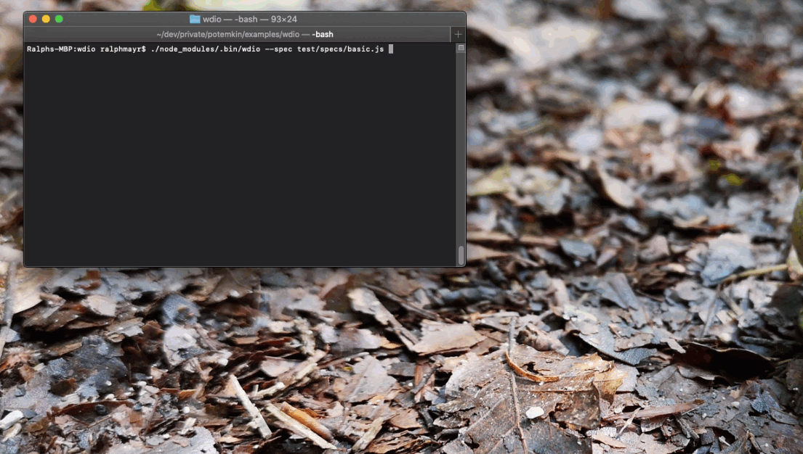
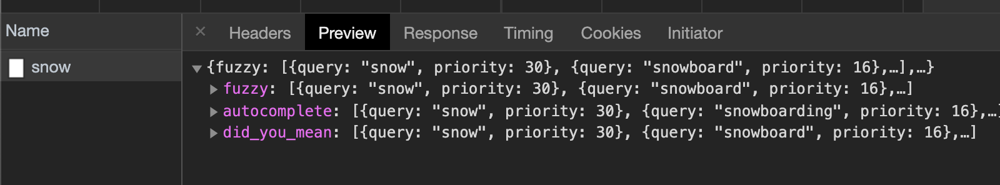

# potemkin

potemkin is a simple tool to mock REST calls while testing web applications.

## Motivation

While many good frameworks exist to test REST APIs and validate their responses, few approaches allow you to do the opposite: Mock the backend with fixed REST responses to validate that the frontend behaves as expected.

The product we develop at [Cockpit365](https://cockpit365.com/) is a modern web-based application that uses Java and Spring on the backend, and [Angular](https://angular.io/) on the frontend. Our test stack is multi-layered:

* Integration tests: [Selenium](https://selenium.dev/)
* Backend performance tests: [Gatling](https://gatling.io/)
* Backend API tests: [Gatling](https://gatling.io/)
* Backend unit tests: [JUnit](https://junit.org/junit5/)
* Frontend unit tests: [Jasmine](https://jasmine.github.io/) + [Karma](https://karma-runner.github.io/latest/index.html)

Still, we have a significant gap when it comes to testing the frontend. All we have are __unit tests__ which are quick and can run as part of the build, but are very limited in terms of functionality they can cover; and __integration tests__ which also test the frontend, but require the entire application, including the backend, to be available for testing.

That strategy leaves us with several downsides:

1. __Stability__: A failing integration test can have many culprits: The problem could be the frontend, the backend, the infrastructure, timing, or a lot of other things. Investigating flaky integration tests is tedious and time consuming.
2. __Performance__: Provisioning the infrastructure (database, test data, backend setup, ...) required for running the integration tests takes a couple of minutes at least. Therefore, turnaround times for testing frontend-related changes are never as fast as we'd like them to be.
3. __Data__: If we want to test corner-cases as part of the integration tests, we need to provision a lot of test data. Scenarios like _"the users password is expired and needs to be changed"_, _"since the last login the user was mentioned in three conversations"_, or _"the user has ten thousand items in his inbox"_ are quite hard to recreate for testing.

We therefore developed __potemkin__ to fill that gap: With potemkin we can run Selenium tests against the frontend __without the need for the backend to be available__ by providing __mock responses__ to the frontend.

## How it works

potemkin uses [Puppeteer](https://github.com/puppeteer/puppeteer) to launch Chromium and intercept the network requests the frontend would normally make to the backend. Which requests to intercept, and which responses should be returned, can be dynamically configured using the [REST API](#API), and even changed during the same test run.

potemkin exposes the [Selenium W3C protocol](https://www.w3.org/TR/webdriver/) via which any test tool that supports [Selenium Grid](https://github.com/SeleniumHQ/selenium/wiki/Grid2) can test using the "pupeteered" Chromium. That includes popular tools like [webdriverio](https://webdriver.io/) and [Protractor](https://www.protractortest.org/#) and of course plain old [Java Selenium](https://selenium.dev/documentation/en/).

## Example

```
describe('unsplash.com', () => {
  before(() => {
    potemkin = new Potemkin();
  });

  it('should should render proposed search terms', async () => {
    await potemkin.setPatterns([{
      urlPattern: 'https://unsplash.com/nautocomplete/snow',
      method: 'GET',
      mockResponse: JSON.stringify({
        autocomplete: [{
          query: 'Thats what I expected',
        }]
      })
    }]);

    await browser.url('https://unsplash.com/');
    const search = await $('#SEARCH_FORM_INPUT_homepage-header-big');
    await search.setValue('snow');
    await browser.pause(1000);
    const suggestions = await $$("//li[@data-suggestion-index]");
    expect(suggestions.length).to.equal(1);

    expect(await suggestions[0].getText()).to.equal('Thats what I expected');
  })
})
```



## Setup and launch

### Option 1: Using the binary package

TODO

### Option 2: Building from source

#### Setup

```
$ git clone https://github.com/ralphmayr/potemkin.git
$ cd potemkin/server
$ npm install
$ ./node_modules/webdriver-manager/bin/webdriver-manager update
```

#### Launch

```
$ cd server && npm start
```

## Tutorial

Say we need to test the auto complete search functionality of [https://unsplash.com](https://unsplash.com):


There are a lot of things we can and should consider:

* Can the user type into the search field?
* Are the correct suggestions displayed?
* Are the suggestions ordered correctly?
* Does clicking a suggestion open its details page?
* ...

### A simple test

Using [webdriverio](https://webdriver.io/), [mocha](https://mochajs.org/), and [chai](https://www.chaijs.com/) we can write a simple test for that page:

```
await browser.url('https://unsplash.com/');

const search = await $('#SEARCH_FORM_INPUT_homepage-header-big');
await search.setValue('snow');
await browser.pause(1000);

const suggestions = await $$("//li[@data-suggestion-index]");
expect(suggestions.length).to.equal(5);

expect(await suggestions[0].getText()).to.equal('snow');
expect(await suggestions[1].getText()).to.equal('snowboarding');
expect(await suggestions[2].getText()).to.equal('snowboard');
expect(await suggestions[3].getText()).to.equal('snowing');
expect(await suggestions[4].getText()).to.equal('snowflake');

await suggestions[0].click();
const title = await $("<h1>");
expect(await title.getText()).to.equal('Snow');
```

But while that test covers all the aforementioned areas, it can lead to some problems down the road.

### Stability

Using the awesome [Chrome Debug Tools](https://developers.google.com/web/tools/chrome-devtools/network) we can see that the frontend makes a simple [XHR](https://developer.mozilla.org/en-US/docs/Web/API/XMLHttpRequest) request to fetch the autocomplete suggestions:



In our test, we can now use the potemkin API to mock the response:

```
await new Promise((resolve, reject) => {
  const pattern = {
    urlPattern: 'https://unsplash.com/nautocomplete/snow',
    method: 'GET',
    mockResponse: fs.readFileSync(`${__dirname}/snow.json`, 'utf-8')
  };

  request('http://localhost:1774/api/patterns', {
    method: 'POST',
    json: [pattern]
  },
    async (err, response, body) => {
      if (err) {
        reject();
      } else {
        resolve();
      }
    }
  );
});
```

Now, we can run that test over and over again and it'll definitely test __only__ the frontend functionality of rendering a sorted list of results.

### Corner cases

We can now simply change the json data in order to test more exotic corner cases. For example, how does the ui respond if the proposal is unusually long? Let's change the data so something like this:

```
"autocomplete": [
  {
    "query": "snowsnowsnowsnowsnowsnowsnowsnowsnowsnowsnowsnowsnowsnowsnowsnowsnowsnowsnowsnowsnowsnowsnowsnowsnowsnowsnowsnowsnowsnowsnowsnowsnowsnowsnowsnowsnowsnowsnowsnowsnowsnowsnowsnowsnowsnowsnowsnowsnowsnowsnowsnowsnowsnowsnowsnowsnowsnowsnowsnowsnowsnowsnowsnowsnowsnowsnowsnowsnowsnowsnowsnow",
    "priority": 30
  },
  ...
```

And run our test again. Here's what happens:


Depending on the environment we're operating in, that may or may not constitute a bug worth fixing, but it's definitely good to know that we have an issue in that area.


## Command line options

TODO

## API

TODO

